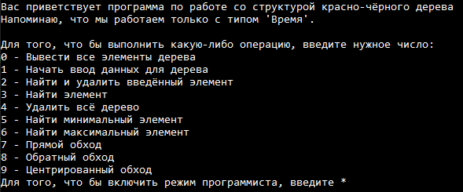
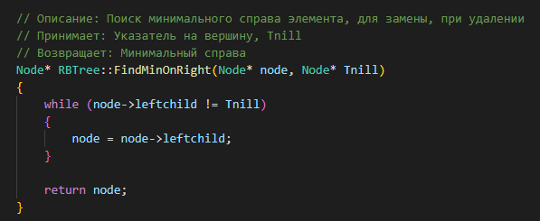
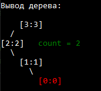
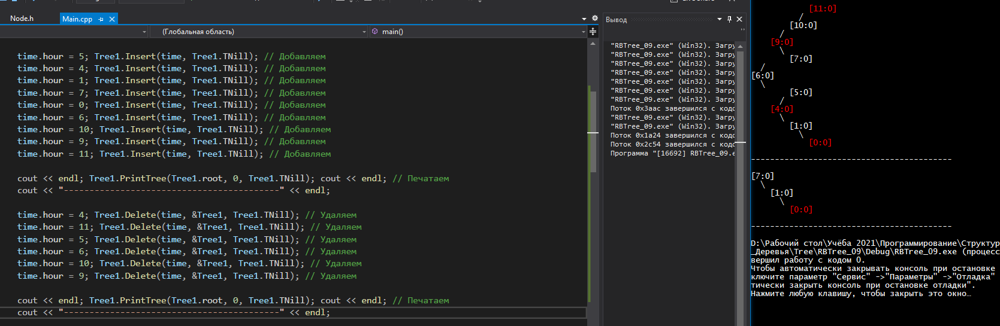
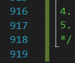

## Реализация структуры красно-чёрного дерева, со структурой вершины Время 🕓 (HH:MM)

Это был второй курсовой проект по Структурам данных, и мне попалась самая сложная тема. Из всех типов деревьев, мне нужно было реализовать алгоритм управления Красно-чёрным деревом

Надо ли говорить, что его структура и правила намного сложнее аналогов: Если у АВЛ всего 4 правила на перестановку вершин, то у КЧ из 12 (включая самые разные, по типу красной тёти, чёрного дяди и т.п. - то есть правила уходят на 3 уровня в глубину дерева)

Написать работающую программу, которая бы соответствовала всем заданным правилам, мне удалось не сразу. Фактически, это был первый очень сложный проект по учёбе в универе. Но я справился, попутно улучшив свои навыки в программировании

Для того, что бы не запутаться, я для каждой функции сделал описание: то что она делает, что принимает, и возвращает. Это помогло структурировать код, и сделать его более читаемым

А также я не забыл и про красоту - элементы дерева действительно красятся в красный цвет 

Усложнением задания были такие условия, как использование структуры вершин "Время" - часы и минуты, вместо обычных числовых значений, а также сохранение дублирующихся элементов счётчиком count

Пример работы программы:

Данная программа получилась достаточно сложной, и я долго не мог отладить её на 100% - когда я приходил к преподавателю её сдавать, он всегда находил какие-то ошибки в её работе. По этому я решил написать автотест для неё: Т.к. управление у меня происходило через терминал, я просто прикрутил к нему вмето ввода с клавиатуры, генератор случайных чисел. Это должно было сработать в любом случае - программа должна была обрабатывать любые ошибки. И это сработало! Тестирование производилось так: Я создал автотест, который был рассчитан на 20-30 элементов дерева, затем он также случайно удалял их, и потом начинал заполнение заново. Я включал его, и если он бесперебойно работал в течении 10-15 минут, то программа была готова. Также, для того, что бы всё отлаживать я добавил логирование действий, и в конечном итоге всё получилось

